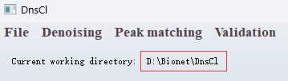
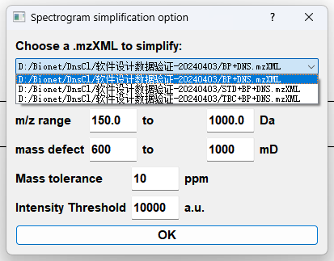
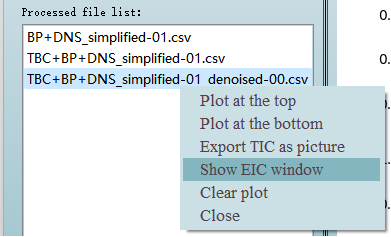
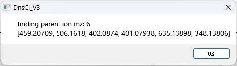
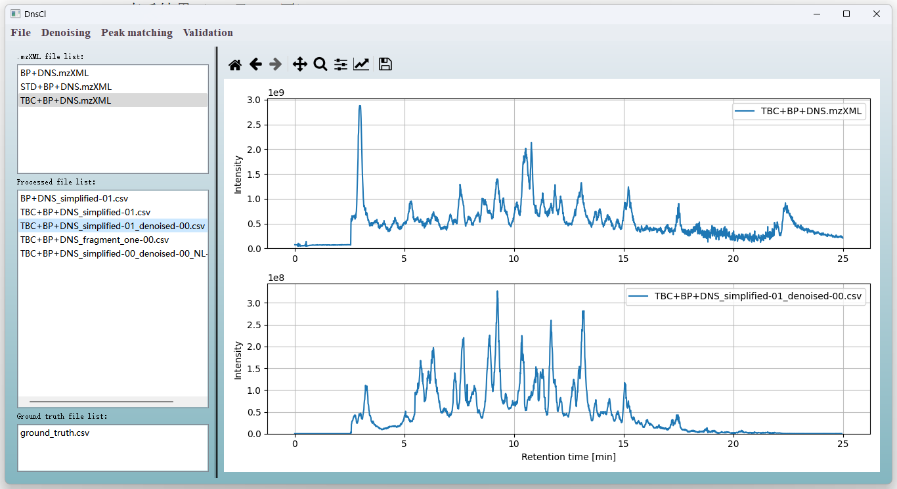
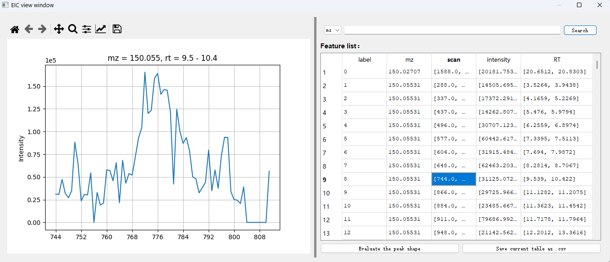
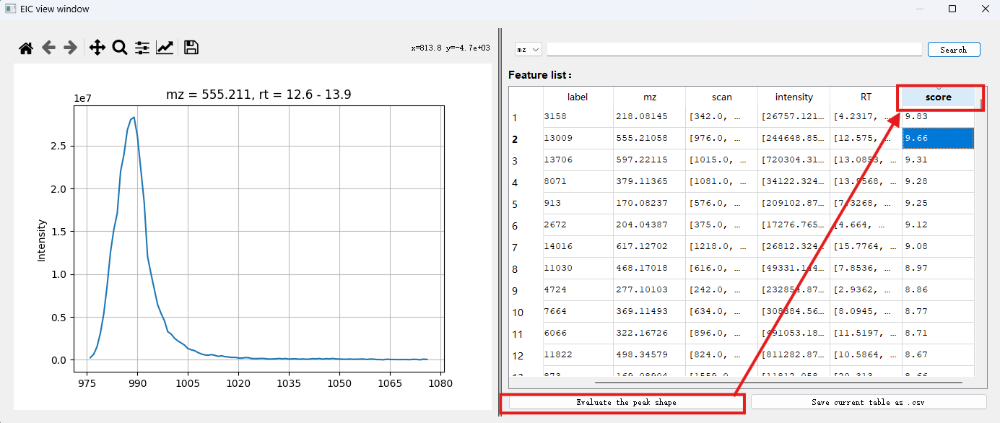

# LC-MS Data Processing Tool

A comprehensive tool for LC-MS data processing, including denoising, peak matching, validation, and visualization.

## Table of Contents
1. [File Import](#1-file-import)
2. [Denoising](#2-denoising)
   - [Spectrogram Simplification](#1-spectrogram-simplification)
   - [Background Subtraction](#2-background-subtraction)
3. [Parallel 3D Identification](#3-parallel-3d-identification)
   - [Neutral Loss Matching](#1-neutral-loss-matching)
   - [Feature Fragment Recognition](#2-feature-fragment-recognition)
   - [Isotope Differential Matching](#3-isotope-differential-matching)
4. [Validation](#4-validation)
5. [Viewing Results](#5-viewing-results)
   - [TIC Plotting](#1-tic-plotting)
   - [EIC Plotting](#2-eic-plotting)
   - [Peak Shape Scoring](#3-peak-shape-scoring)

---

## 1. File Import
**Menu: File**  
- **Open *.mzXML**: Import raw data files
- **Open processed file (*.csv)**: Import previously processed data for reuse
- **Open ground truth file (*.csv)**: Import validation data (requires "mz" and "RT" columns)
- **Change work directory**: Set directory for automatic result saving

> Current working directory is displayed below the menu bar.

---

## 2. Denoising
**Menu: Denoising**

### (1) Spectrogram Simplification
1. Select **Spectrogram simplification**
2. Set parameters in the pop-up window
3. Click **OK** to process
   - Progress bar will show during processing
   - Results auto-saved as *.csv and imported to **Processed file list**

### (2) Background Subtraction
**Prerequisites**:  
- Processed blank data
- Processed sample data

1. Select **Background subtraction denoise**
2. Choose files and set parameters:
   - `Cut the section at breakpoints`: Scan threshold for feature splitting
   - `Keep features longer than points`: Minimum scan count for feature retention
3. Click **OK** to process

> Right-click processed files and select **Show EIC window** to view segmented features.

---

## 3. Parallel 3D Identification
**Menu: Peak matching**

### (1) Neutral Loss Matching
1. Select **Neutral loss match**
2. Choose background-subtracted file
3. Set parameters and click **OK**

### (2) Feature Fragment Recognition
1. Select **Feature fragment recognition**
2. Choose both:
   - Original *.mzXML file
   - Background-subtracted file
3. Enter fragment m/z values (comma-separated)
4. Click **OK**

### (3) Isotope Differential Matching
1. Select **Isotope differential m/z value**
2. Choose background-subtracted file
3. Set parameters and click **OK**

> All results auto-saved and imported to **Processed file list**.

---

## 4. Validation
**Menu: Validation**

**Prerequisite**: Import ground truth file via **File → Open ground truth file (*.csv)**

1. Select validation function
2. Choose:
   - Target processed file
   - Ground truth file
3. Set parameters and click **OK**

> Results show matched precursor ions count and m/z values.

---

## 5. Viewing Results

### (1) TIC Plotting
- Right-click files in **.mzXML file list** or **Processed file list**
- Select **Plot in upper/lower panel** for visual comparison
- Mouse wheel synchronizes x-axis zoom

### (2) EIC Plotting
- Right-click processed files → **Show EIC window**
- Click table rows to view m/z-RT peaks
- Sort by clicking column headers
- Use search bar to filter by m/z or RT values

### (3) Peak Shape Scoring
**Requirement**: Place trained model (`model.pth`) in working directory

1. In EIC window, click **Evaluate the peak shape**
2. New `score` column appears
3. Sort by score to identify high-quality peaks
4. Click **Save current table as .csv** to export

